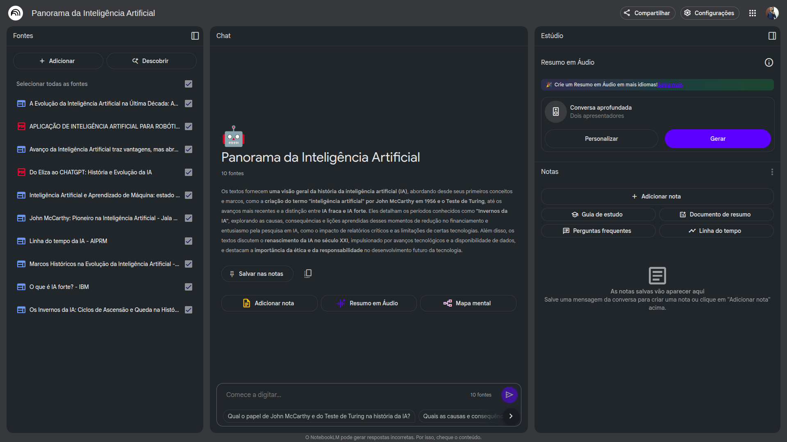
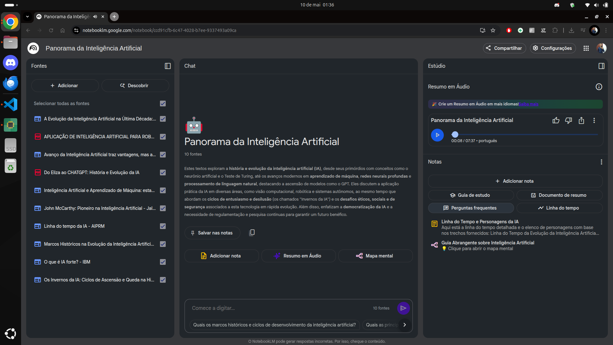
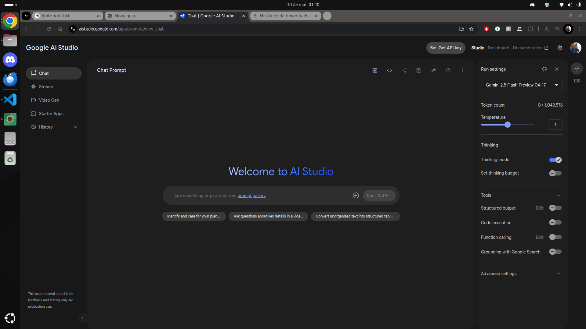

# Mastercalss: COmo a IA APRENDEU A FALAR 

# Súmario 
[Notações](#notações-sobre-a-aula)  
[Links e refs](#links-uteis)  

## Notações sobre a Aula 
O primeiro prompt demonstrado na aula foi 
```
Crie um mapa cronológico da história e evolução da Inteligência Artificial, desde a origem do termo até hoje em dia 
```
Ao selecionar tal opção será carreda as fontes correlatas sobre o prompt inserido, mostrando quais foram as fontes encontradas durante a pesquisa do assunto de seu prompt, pode-se optar pela importação completa ou parcial dos artigos encontrados.  
Quando as fontes forem devidamente carregas o [Google Gemini](https://gemini.google.com/app), irá apresentar a seguinte tela: 
<div id="pompt_img">
  
</div>

Uma nova funcionalidade implementada no notebookLM foi a de geração de um mapa mental:
<div id="Mapa_mental">
  
</div>


<div style="border-left: 4px solid red; background-color:rgb(22, 23, 24); padding: 10px;">
  <strong style="color: red;">Importante!</strong>
  <p>Ao utilizar a oção de gerar conversa aprofundada, o Notebooklm, irá gerar ao usuário uma especie de podcast ao usuário</p>
</div>


<div id="audio_nlm">
  
</div>

Através do [Google AI Studio](https://aistudio.google.com/app/prompts/new_chat?hl=pt-br), é possível realizar o updload de algum arquivo em mp3 ou algo do tipo, para que possa transcrever o áudio em portugês com simples comando apenas subindo o arquivo e gerando um prompt como transcreva o audio x. 
com o arquivo em questão. 
<div id="audio_nlm">
  
</div>

## Links Uteis  
[NotebookLM](https://notebooklm.google.com/?pli=1)  
[Google Gemini](https://gemini.google.com/app)  
[Google AI Studio](https://aistudio.google.com/app/prompts/new_chat?hl=pt-br)  


  <table style="text-align: center; width: 100%;"> 
  <caption><b>Skls do projeto </b></caption>
  <tr>
      <td style="text-align: center;">
      
      </td>
      <td style="text-align: left;">
      
      </td>
  </tr>
  </table>

  ---
  titulo: Aula 0 Como a ia aprendeu a falar?  
  autor: Thierry Lucas Chaves  
  data_criacao: 2025-05-10  
  data_modificacao: 2025-05-13  
  versao: 1.0  
  ---