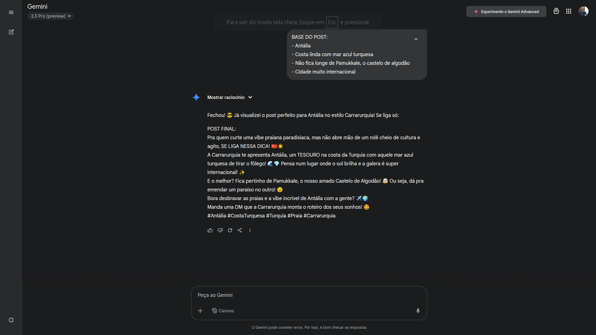
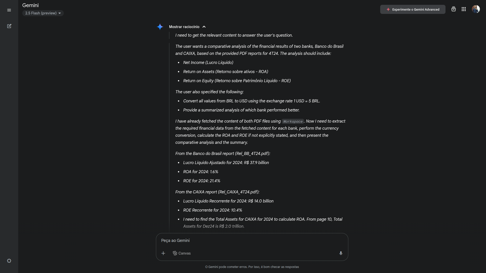
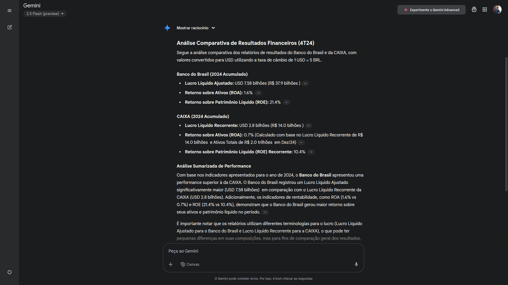

# Como conversar com a IA e fazer ela trabalhar pra você
Boas-vindas! Chegou a hora de mergulhar na segunda aula da **`Imersão IA da Alura e do Google Gemini`** para dar um novo passo na sua carreira! Vamos nessa?

- [Acesse o Google Gemini](https://gemini.google.com/app?android-min-version=301356232&ios-min-version=322.0&is_sa=1&campaign_id=alura_may25&utm_source=alura&utm_medium=referral&utm_campaign=alura_may25&pt=9008&mt=8&ct=ref-alura-brmay25) 

## Introdução 
Nesta aula, iremos conhecer as melhores técnicas e práticas de Engenharia de Prompt!
Nesta aula, você vai:
- Aprender os princípios de uma boa Engenharia de Prompt. 
- Comparar técnicas como Zero-Shot, Few-Shot e Chain-of-Thought. 
- Criar conteúdos reais: Posts, NewsLetters e imaagens com prompts estruturados. 
- Aplicar a IA em diferentes áreas, como marketing e finanças, usando dados reais. 
---  
## Links importantes para você acompanhar a aula
- [Google Gemini](https://gemini.google.com/app?android-min-version=301356232&ios-min-version=322.0&is_sa=1&campaign_id=alura_may25&utm_source=alura&utm_medium=referral&utm_campaign=alura_may25&pt=9008&mt=8&ct=ref-alura-brmay25)  
- [Relatório do Banco do Brasil](https://api.mziq.com/mzfilemanager/v2/d/5760dff3-15e1-4962-9e81-322a0b3d0bbd/fb3957f5-2b55-aa96-b753-aa625b45ac02?origin=1&pk_vid=49b9d904e6f38dc917467175140cc515)  
- [Relatório da Caixa](https://api.mziq.com/mzfilemanager/v2/d/fb86b0b8-b4e9-407b-a575-ba3668a566a9/5d6a858d-e0d1-4f41-402e-95b3e18a964c?origin=1)  
- [Guia de Design de Prompts do Google](https://ai.google.dev/gemini-api/docs/prompting-strategies?hl=pt-br)  
- [Acesse o guia de Mergulho](https://grupoalura.notion.site/Imers-o-IA-Guia-de-Mergulho-1d2379bdd09b803982a5ee1abd89e0cb?pvs=4)  

---

## Megulhe mais profundo 

Aprofunde-se nos seguintes tópicos:
- Mergulhe a fundo em carreiras tech com o [Techguide](https://techguide.sh/).
- [O que é Engenharia de Prompt e quais as suas principais técnicas?](https://www.alura.com.br/artigos/engenharia-prompt#principios-para-a-criacao-de-um-prompt)
- [Machine Learning no mundo da biometria, Google Gemini e verificação de alucinações Hipsters: Fora de Controle #29](https://www.alura.com.br/podcast/hipsterstech-machine-learning-no-mundo-da-biometria-google-gemini-e-verificacao-de-alucinacoes-hipsters-fora-de-controle-29-a9140)


## Sumário
- [Introdução](#1-introdução)
- [Técnicas de engenharia de prompt](#2-técnicas-de-engenharia-de-prompt)
- [Dívidir e conquistar](#21-divir-e-consquistar)
- [Zero-Shot, Few-Shot e Chain-of-Thought](#22-zero-shot-few-shot-e-chain-of-thought)
  - [Zero-Shot Prompting](#221-zero-shot-prompting)
  - [Few-Shot Prompting](#222-few-shot-prompting)
  - [Chain-of-Thought Prompting](#223-chain-of-thought-prompting)
  - [Texto para Imagem](#224-texto-para-imagem)

---
# Notações Sobre a Video Aula 

## 1. Introdução 
A engenharia de prompt pode-se resumir em como escrever o prompt para extrair as melhores respostas do modelo.   
Um dos exemplos citados durante a aula foi o de Geração de código para verificação de ano bissexto.   
[O primeiro código](src/Ano_bissexto.py), foi gerado com um pequeno prompt sem especificação de linguagem ou algo do tipo, então o modelo decidiu que o código a se demonstrado fosse em `Python`, porém [no segundo código](src/ANO_BISSEXTO.ts), foi dado mais contexto ao modelo especificando a linguagem e adicionado mais algumas especificações para a geração solicitando por exemplo, que o código em questão deveria ser em `TypeScript`.  

Para cirações de prompts, é valido sempre ressaltar a primeira "técnica" de engenharia de prompt, que é **Seja especifico na sua solicitação ***  

## 2. Técnicas de engenharia de prompt 

### 2.1 Divir e consquistar 
Quando estamos lidando com cenários mais complexos, é uma *"boa prática"*, realizar a divisão do que se deseja do modelo, em linhas gerais, podemos dividir nossa solicitação com subtópicos lista numerada etc.. 
Ex:
```
Trabalho para uma agência de viagens chamada Carraurquia. Crio campanhas de marketing para brasileiros de idade entre 30 e 60 anos que se interessam por história e cultura. Quero criar  uma campanha focada em viagens para Turquia, com passeios em Istambul, izmit e na Capadócia

Primeiro: Pesquise sobre os melhores passeios nessas cidades e me diga quais são.  
Na sequência: Organize um plano de viagens que inclua esses passos, e me mostre quais são esses planos. 
Por fim crie um post de campanha para intagram para cada uma das cidades , e me mostre os posts sugeridos 

```
Já com o segundo prompt, foi solicitado ao modelo que "agisse" como um especialista, ou seja foi dado um contexto de como era esperado a resposta, o que fez com que a saída do prompt fosse um pouco diferente. 

```
Aja como um especialista de redes sociais que trabalha para uma agência de viagens chamadas Carrarurquia. Crie campanhas de marketing para brasileiros de idade entre 30 e 60 anos que se interessam por história e cultura. Quero criar  uma campanha focada em viagens para Turquia, com passeios em Istambul, izmit e na Capadócia

Primeiro: Pesquise sobre os melhores passeios nessas cidades e me diga quais são.  
Na sequência: Organize um plano de viagens que inclua esses passos, e me mostre quais são esses planos. 
Por fim crie um post de campanha para intagram para cada uma das cidades, e me mostre os posts sugeridos 
```  

### 2.2 Zero-Shot, Few-Shot e Chain-of-Thought. 

#### 2.2.1 Zero-Shot Prompting   
No modelo de Zero-Shot prompts, é quando ao se interagir com algum modelo de I.A, não se fornece um exemplo/amostra, ou seja quando ao se "conversar" com o modelo de I.A somente é feito o pedido a solicitação, mas não é fornecido do exemplo da formatação ou algo do modelo.  
EX: 
```
Me dê os melhores passeios da Turquia com uma avaliação.
```

####  2.2.2 Few-Shot Prompting
O few-shot, e quando se da alguns exemplos ou amostras para realizar o prompt no modelo de I.A, para que ele entenda como se deseja "formatar a saída".
Ex:
```
Me dê os melhores passeios da Turquia com uma avaliação.
Eu quero que essa avaliação seja no seguinte formato. 

Nome do passeio 1
Cidade do passeio 1 
Avaliação 1

Nome do passeio 2
Cidade do passeio 2
Avaliação 2

```
ou também é possível gerar os exemplos da seguinte maneira, trocando a generalidade (passeio 1 avaliação 1), por algo mais especifico 

```
Me dê os melhores passeios da Turquia com uma avaliação.
Eu quero que essa avaliação seja no seguinte formato. 

Hagia Sophia 
Istambul 
10/10

Passeio de balão 
Cpadócia
9,8/10
```
O que diverge o primeiro do segundo prompt acima, e que nesse modelo além de inserir os exemplos, é possível também dar os valores especificos para esse `Few-Shot`.  

#### 2.2.3 Chain-of-Thought Prompting 
Nesse modo "Cadeia de pensamento", nesse modelo de prompt, é utilizado para "ensinar" o modelo a pensar, ou seja é inserido nele para que o modelo responda conforme o seu desejo de pensamento. Nesse modelo  pode ser feito uma mistura de do modelo de `Chain-of-Thought Prompting` com o modo de 
[Few-shot](#222-few-shot-prompting)
EX:
```
Aja como um gerente de redes sociais. Eu quero que você me ajude a criar posts para o Instagram para a minha agência de viagens "Carrarurquia", com foco em viagens para a Turquia. Os posts devem ter entre 3 a 5 hashtags de acordo. 

Para você entender o meu tom de escrita, eu vou dar 3 exemplos, de acordo com o formato a seguir: 

- "BASE DO POST" (Contendo as informações mais importantes)
- "POST FINAL" (Contendo o posto final que foi realmente publicado no Instagram)

####
BASE DO POST 1:
- Istambul 
- Visite a basílica de Santa Sofia. 
- Originalmente uma basílica ortodoxa grega, posteriormente uma mesquita otomana e, mais recentemente, um museu.
- Compre ingressos sem fila conosco

####
POST FINAL 1:
E aí, galera! 👋 Partiu Turquia?
A Carrarurquia te leva para conhecer a incrível Istambul!🌟
Um dos rolês imperdíveis por lá é a majestosa Basílica de Santa Sofia ⛪🕌🏛️ Sabia que ela já foi igreja, mesquita e hoje é um museu LIN-DO de viver?😍
E para não perder tempo em fila, a gente já garante seus ingressos! 😉 Com a Carrarurquia, sua trip é só alegria! 😎
Manda um direct e bora planeja essa aventura! ✈️🌍
#Istambul #Turquia #Carrarurquia #História #Cultura

####
BASE DO POST 2:
- Capadócia
- Voo de balão inesquecível 
- Paisagens únicas e formações rochosas incríveis. 
- Ver o nascer do Sol. 
- Reserve seu passeio de balão conosco

####
POST FINAL 2:
Prepara o coração para essa experiência SURREAL!❤️‍🔥
A Carrarurquia te leva para voar de balão na Capadócia! 🏮🌄 imagina só sobrevoar aquelas paisagens e as formações rochosas INCRÍVEIS ao nascer do sol? 🌟 é simplesmente MÁGICO!😍
 Quer viver essa emoção? Então corre para reservar seu passeio de balão com a gente!😉 
Garanta já seu lugar nessa aventura inesquecível! 🚀
Manda um direct e vamos planejar essa trip dos sonhos! 🤩🌍
 #Capadócia #Balão #Turquia #Carrarurquia #Aventura

####
BASE DO POST 3:
- Pamukkale
- Viste o "Castelo de Algodão"
- Piscinas termais de calcário branco 
- Explore as ruínas da antiga cidade de Hierápolis 

#### 
POST FINAL 3:

Se liga nessa vibe!🤩 A Carraurquia te leva para conhecer Pamukkale, o famoso "Castelo de Algodão" na turquia! Parece até outro planeta, né? 🤯
Esses terraços de calcário branco com águas termais são uma maravilha ÚNICA no mundo!💙
E pertinho dali, ainda rola explorar as ruínas da antiga cidade de Hierápolis!🏛️ História e natureza em um só lugar!🌟
Quer desbloquear o modo de aventura e conhecer essa beleza de perto?😉 então fala com a gente no direct! A Carraurquia te leva para essa e muitas outras trips incríveis!✈️🌍
#Pamukkale #CasteloDeAlgodão #Turquia #VIagem #Carrarurquia

####
Depois de ter analisado todos esses posts e aprendido o meu tom de escrita, eu vou te enviar uma "BASE DO POST" e quero que você gere um "POST FINAL" correspondente 
```  
Depois do primeiro prompt para contextualizar o modelo usando a estragia de [Chain-of-Thought Prompting](#223-chain-of-thought-prompting) e combinando com o modelo de [Few-shot](#222-few-shot-prompting), esse passo e como se fosse realizado a calibragem do modelo para de fato realizar ou solucionar o problema a ser encarado. Foi então realizado o seguinte prompt para geração do modelo final conforme desejado. 
```
BASE DO POST:

- Antália

- Costa linda com mar azul turquesa

- Não fica longe de Pamukkale, o castelo de algodão

- Cidade muito internacional
```  
E tive o seguinte resultado:
<div id="Resultado de Prompt">
  
</div>

##### 2.2.4 Texto para Imagem 
Com base no post gerado utilizando o método de [Chain-of-Tought](#223-chain-of-thought-prompting), foi utilizado esse resultado, para solicitar a ciração de uma imagem para ilustrar o post e tivemos o seguinte resultado. 
<div id="Imagem do prompt">
  
</div>

### 2.3 Utilizando a I.A para analise em dados reais 
Nessa seção foi utilizado um modelo utilizando as técnicas de [Chain-of-Tought](#223-chain-of-thought-prompting) e [Few-Shot Prompting](#222-few-shot-prompting), para gerar uma analise em um diferente cenário baseado em dados reais obtidos através dos dados em: 
[Relatório Banco do Brasil](db/Rel_BB_4T24.pdf) e [Relatório Caixa](db/Rel_CAIXA_4T24.pdf). Para tal tarefá foi utilizado o seguinte prompt:
```
Você é um assistente que ajuda com análises de relatórios financeiros de bancos. 


Realize uma análise comparativa dos relatórios de resultados que estou te enviado em anexo. 


Suas análises seguem o formato dos exemplos abaixo:


Exemplo banco 1:

Lucro Líquido: XX

Retorno sobre ativos (ROA): XX%

Retorno sobre Patrimônio Líquido(ROE): XX


Exemplo banco 2:


Lucro Líquido: YY

Retorno sobre ativos (ROA): YY%

Retorno sobre Patrimônio Líquido(ROE): YY


Antes do resultado final, você vai:


- Para valores em moeda, você deve considerar 1USD = 5BRL

- Depois, você vai converter os valores em R$ para U$

- Por fim, você vai trazer uma análise sumarizada de qual dos bancos eestá performando melhor 
```  

E como resultado tivemos a seguinte saída pelo modelo . 

<div id="Output-Gemini1">
  
</div>
<div id="Output-Gemini2">
  
</div>

---


  <table style="text-align: center; width: 100%;"> 
  <caption><b>Skls do projeto </b></caption>
  <tr>
      <td style="text-align: left;">
      
      </td>
      <td style="text-align: center;">
      
      </td>
      <td style="text-align: rigth;">
      
      </td>
      <td style="text-align: rigth;">
      
      </td>
  </tr>
  </table>   

  ---
Titulo: Aula 2 Como conversar com a IA  
Autor: Thierry Lucas Chaves    
Data criacao: 2025-05-13  
Data modificacao: 2025-05-14  
Versao: 1.0    
---