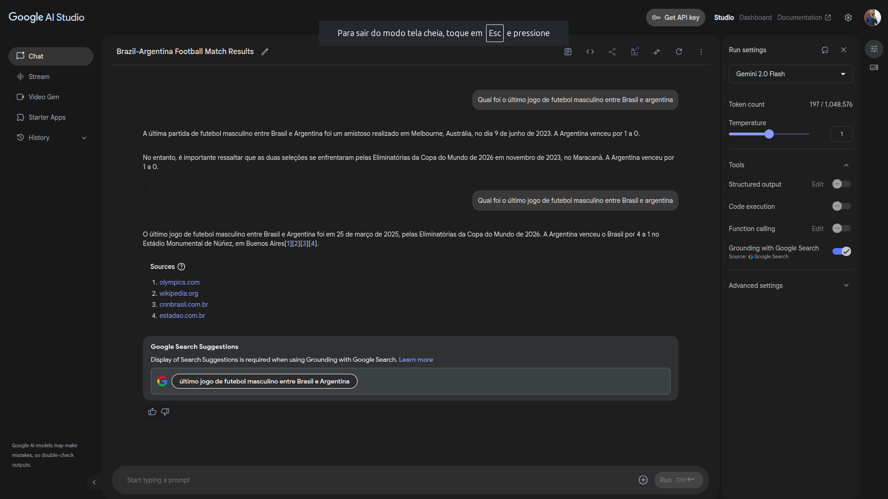
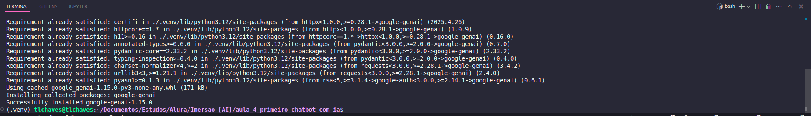
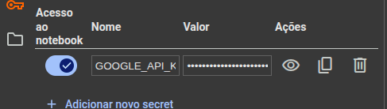

# Criando seu primeiro chatbot com IA generativa

## Bem-vindos à quarta aula! Chegou a hora de mergulhar na quarta aula da **Imersão IA da Alura e do Google Gemini** para dar um novo passo na sua carreira!  

- [Acesse o Google Gemini](https://gemini.google.com/?android-min-version=301356232&ios-min-version=322.0&is_sa=1&campaign_id=alura_may25&utm_source=alura&utm_medium=referral&utm_campaign=alura_may25&pt=9008&mt=8&ct=ref-alura-brmay25)
- [Acesse o Google AI Studio](https://aistudio.google.com/app/prompts/new_chat?utm_source=website&utm_medium=referral&utm_campaign=Alura-may-25)
- [Pegar a API Key no Google AI Studio](https://aistudio.google.com/app/apikey?utm_source=website&utm_medium=referral&utm_campaign=Alura-may-25)
---
## Introdução 
Nesta aula, você vai gerar sua API Key no Google AI Studio e programar um chatbot em `Python` com o SDK do Gemini no Google Colab 
- Gerar e usar sua API Key no Google AI Studio 
- Codificar no Google Colab com o SDK do Gemini 
- Explorar os parâmetros da API e aprender a usá-la com `Python`
- Construir um chatbot básico usando a Gemini API, testando diferente interações. 

### Link do projeto 
- [Código Final da aula4](https://colab.research.google.com/drive/1KJRja3ioeTeyMpUWkNJOKNdCX7Qcq4e5?usp=sharing)
----
## Links importantes para você acompanhar a aula 
- [Google AI Studio](https://aistudio.google.com/app/prompts/new_chat?utm_source=website&utm_medium=referral&utm_campaign=Alura-may-25)
    - [Pegar a API Key no Google ai Studio ](https://aistudio.google.com/app/apikey?utm_source=website&utm_medium=referral&utm_campaign=Alura-may-25)
- [Google Colab](https://colab.research.google.com/)
- [Google Gemini](https://gemini.google.com/app?android-min-version=301356232&ios-min-version=322.0&is_sa=1&campaign_id=alura_may25&utm_source=alura&utm_medium=referral&utm_campaign=alura_may25&pt=9008&mt=8&ct=ref-alura-brmay25)
- [Guia de início rápido na API Gemini](https://ai.google.dev/gemini-api/docs?utm_source=website&utm_medium=referral&utm_campaign=Alura-may-25&hl=pt-br)
- [Exemplos do Google AI Studio](https://ai.google.dev/gemini-api/prompts?utm_source=website&utm_medium=referral&utm_campaign=Alura-may-25&hl=pt-br)
- [Cookbook de códigos do Gemini](https://github.com/google-gemini/cookbook)
---

## Como compartilhar seu `Projeto`
Compartilhe seu codespace com outras pessoas pelo [GitHub](https://github.com/):
- Acesse [aqui](https://www.youtube.com/watch?v=QHhmjNJZPoY&ab_channel=Alura) o tutorial para saber como subir seu projeto no GitHub; Lembre-se de não compartilhar a sua API Key no seu projeto do Google Colab para o Github.
- Na página inicial do GitHub, clique no botão "New" (Novo) localizado no canto superior direito;
- Preencha o nome do seu repositório e uma breve descrição. Escolha se deseja que o repositório seja público (visível para todos) ou privado (acessível apenas por convite);
- Você pode optar por inicializar o repositório com um arquivo README, que é uma boa prática para fornecer informações sobre o projeto. Além disso, você pode escolher uma licença para o seu código, se desejar;
- Você pode especificar tipos de arquivos que o Git deve ignorar ao rastrear alterações. Por exemplo, você pode selecionar uma linguagem de programação específica para gerar um arquivo .gitignore correspondente;
- Se o seu projeto se encaixa em um dos modelos de projeto disponíveis, você pode escolher um para iniciar com estrutura pré-definida;
- Após preencher todas as informações necessárias, clique no botão "Create repository" (Criar repositório) para criar o seu repositório;
- Para saber mais confira os [primeiros passos no GitHub](https://www.alura.com.br/artigos?hsa&hsa_acc=7964138385&hsa_ad=688089973825&hsa_cam=20946398532&hsa_grp=153091871930&utm_campaign=&utm_medium=ppc&utm_source=adwords&utm_term=).


Divulgue seu projeto
Quem compartilha seus projetos ganha mais visibilidade no mercado! Poste seu progresso no LinkedIn e use a hashtag #imersaoiagoogle para interagir com outros devs e até chamar atenção de recrutadores!  


---

# Notações Sobre a Video Aula 

## Sumário
- [Notações gerais ](#1-do-código)
- [Configurando variaveis de ambiente](#2-configurando-variaveis-de-ambiente)
- [Importando o SDK](#3-importando-o-sdk)
    - [Instânciando objeto](#31-instânciando-o-modelo)
    - [Construindo um chat](#32-construindo-o-chat)
        - [Configurações de estrutura do chat](#321-configurando-a-estrutura-interna)
        - [Construindo a estrutura de um chat](#322-configurando-as-repetições-de-interações-chat)

Um ponto sobre o `Google IA Studio` e que através do tools do [Google AI Studio](https://aistudio.google.com/app/prompts/new_chat?utm_source=website&utm_medium=referral&utm_campaign=Alura-may-25) é possível utilizar a opção de `Grounding with Google Search `, com essa opção é possível que as interações junto ao prompt do `Google IA Studio` realize uma busca no google antes de gerar a resposta embasado na pesquisa conforme imagem abaixo:  

<div id="Grounding with Google Search">

</div>

## 1. Do código 
Quando se está trabalhando com ferramentas novas, como no caso o gemini se tem *pacotes* ou *bibliotecas*, que comumente são chamadas de **SDK "kit de desenvolvimento de software**, uma **skd** é uma forma mais simplificada de para acessar os serviços, o que implica diretamente em *"escrever menos código"*, ou seja é uma simplificação do acesso para os desenvolvedores.  
Para instalar o SDK do Gemini utiliza-se o `pip` *"(Pip: Ferramenta de instalação de bibliotecas Python)"*. No meu caso em especifico, não estou utilizando o [Google Colab](https://colab.research.google.com/), irei instalar o SDK no ambiente local, porém se estivesse no `Google Colab`, iria instalar a biblioteca mencionada.  
**OBS**: Para utilizar desse artifício na plataforma é necessário adicionar um dos caracteres especiais a seguir  
```
! pip install google-genai
-- ou 
% pip install google-genai
```  
Como esse caso não se aplica irei instalar diretamente na máquina conforme abaixo:
<div id="pipGenai">

</div>

## 2. Configurando variaveis de ambiente 
Como não estou utilizando o `Colab` algumas adaptações tiverem de ser realizadas, sendo elas:
No bash:  

```
export GOOGLE_API_KEY="minha api key"
``` 
Como este comando foi declarado uma váriavel de ambiente para minha api key, conseguinte para realizar a persistencia dessa geração foi adicionado essa variavel de ambiente através dos comando:
```
nano ~/.bashrc
```
 e enserido o comando diretamente, após essa definição de variavel de ambiente, já no meu Notebook Jupyter, utilizei a `SDK os`, para caputra definição dessa variável de ambiente utilizando o comando:
 ```
import os
key = os.environ.get('GOOGLE_API_KEY')
```
Caso estivesse utilizando o Google Colab essa definição de váriavel de ambiente seria um pouco diferente, e seguiria os seguintes passos. 
1. Importar a chave de api para dentro do ambiente do `Google Colab`
     <div id="API_KEY_COLAB">
      
      </div>

2. Dentro do notebook do `Google Colab`, faria a declaração de variavel de ambiente da seguinte maneira. 
    ```
    import os 
    from google.colab import userdata

    os.environ['GOOGLE_API_KEY'] = userdata.get('GOOGLE_API_KEY')
    ```  
A principal diferença é que como estou executando o código em máquina local os passos para definição de de variavel de ambiente são definidas diretamente na máquina, enquanto no google colab utilizase do SDK google.colab userdata para que essa plataforma caputure essa variavel de ambiente no cofre que foi determinado. 

## 3. Importando o SDK 
Para inicializar a SDK mencionada na instalação da [bibliotéca](#1-do-código), iremos então realizar o import de uma *"Sub-modulo"* dessa bibliotéca, para que seja importado apénas o "modulo" `genai *(Generative AI)*`, utilizaremos o seguinte código:  
```
from google import genai
```
### 3.1. Instânciando o modelo 
Após o import do SDK mencionado, podemos então realizar a instância do modelo propriamente dito, a estrutura *"básica"*, segue a seguinte premissa:

```
from google import genai

# No techo abaixo estou instanciando para váriavel chamada de client, que ela tera as propriedades do objeto genai.Client()
client = genai.Client()

# como ainda não sabemos ao certo que modelo será utilizado utilizamos o for para caputra e apresentação desses modelos. 
for model in client.models.list():
    print(model.name)
# No output desse laço, usamos as propriedade do objeto client, com as funções models e list para listas os modelos, como estamo realizando em um laço, 
# e estou atribuindo que para cada client.model.list() será = model, atribui também a propriedade de name, para listar apenas o nome do modelo

# De posse do nome do modelo, por fim, irei atribuir o nome desse modelo em uma variavél, e depois em outra variavel realizar a instancia novamente de cliente 
# Dessa vez será requerido as funções de modelos do cliente e a propriedade de gerar conteudo, como parametro ela espera o modelo e o conteudo
modelo = "gemini-2.0-flash"

resposta = client.models.generate_content(model=modelo,
                                          contents="Quem é a empresa por tras dos modelos Gemini ?")

``` 
Com a estrutura acima apenas definimos a conexão com os servidores do Google, para que ele se conectasse a um módulo especifico do servidor passando uma pergunda a cada instância, se por assim podemos dizer, porém ainda não criamos um chat.  

### 3.2. Construindo o CHAT
Agora que realizamos a instância do objeto e verificamos suas, fucionalidades iremos construir um chatbot propriamente dito, o que diverge o que foi feito no [tópico 3](#31-instânciando-o-modelo), de um chatbot propriamente dito e o seu histórico de conversa, como em um chatbot a premissa é `conversar` com a IA é necessário que esse modelo acesse o histórico das conversas/interações feitas com ele, e para tal complementaremos o código da seguinte maneira:  
```
# Com esse trecho iremos atrbiuir a variavél chat a propriedade de chat do objeto client, e então usar a propridade de criar passando o parâmetro de Modelo
chat = client.chats.create(model=modelo)

# Nesse trecho atribuo a variavel resposta a propriedade de enviar mensagem ao objeto acima nomeado de chat 
resposta = chat.send_message("oi tudo bem?")

# Nesse trecho obtenho o valor de texto para o objeto resposta que recebeu o valor de chat.send_message
resposta.text
```
### 3.2.1 Configurando a estrutura interna 
Conforme visualizado algumas vezes as respostas de um chatbot podem ser demasiadamente longas, o que por vezes atrapalha a interação do usuário junto o chatbot. 
Porém em modelos de `**LLM **` temos um parâmetro para essa criação de resultados, que é chamado de `System Instruction`, essa instrução de sistema, pode-se resumir como as orientações que o modelo criado tem de seguir sempre que ele gerar uma resposta. esse `System Instruction` assemelha-se com o que foi visto em [Engenharia de Prompt](../aula_2_como-conversar-com-a-ia/aula_2_como-conversar-com-a-ia.md), onde se passa algumas definições para o chatbot dizendo como se portar suas premissas usando de técnicas de `Zero-shot`, `Few-Shot` ou `Chain-of-Thought`, o problema dessa abordagem é que sempre teremos que realizar o *"input"* dessa instrução.
Isso funcionária passando em uma variavel ou alguma estrutura para ler essa instrução, porém como estamos realizando a construção de um chatbot com auxilio de uma API. Existe outra maneira, através da SDK `google.genai`, podemos utilizar o modulos types, para que esse `System Instruction` seja persistido dentro desse chatbot, utilizando uma estrutura como o código abaixo:  
```
from google.genai import type 
# Com essa variavel ao ser instânciado novamente o objeto chat, poderemos passar um novo parâmetro para que ele obedeça tal instrução sempre que o objeto for "acionado"
chat_config = types.GenerateContentConfig (
    system_instruction="Realize as instruções desejadas aqui",
)
chat = client.chats.create(model=modelo,config=chat_config)
resposta = chat.send_message("O que é computação quantica")
resposta.text
```
Por fim ainda temos a opção através do objeto de chat a principal objetivo dele que é o armazenamento do histórico, nesse caso para obter / guardar esse histórico instânciamos o objeto chat com a propriedade `chat.get_history()`

### 3.2.2 Configurando as repetições de interações chat
Como o objetivo em si é construir um chatbot, podemos utilizar de um laço de repetição, no caso utilizaremos o while, pois nesse modelo de repetição, o laço não é quebrado enquanto uma determinada instrução não for atingida, uma solução então será que para o usuário sair desse chat, será definido uma `Palavra-chave`, para quebrar o laço de repetição. 
```
prompt = input("Esperando prompt: ")

while prompt != "fim":
    resposta = chat.send_message(prompt)
    print(f"Pergunta: {prompt}")
    print(f"Resposta: {resposta.text}")
    print("\n")
    prompt = input("Esperando prompt: ")
```  
Com esse modelo acima iremos enviar e receber respostas do Gemini, enquanto o mesmo não receber um prompt do usuário com a palavra fim. 

### 4. Fim 
Com isso concluimos a configuração inicial de um chatbot utilizando a SDK do google para conectar com o google Gemini, realizar perguntas e obter respostas tudo através do código e configurações de api de forma simples. 
---
# Do projeto da alura. 
## Enunciado  

1. Deverá gerar ser gerado um projeto utilizando a API do google até o final do sábado a noite 
2. Preencha o [formulário](https://docs.google.com/forms/d/e/1FAIpQLSe2AQOKarxQ79ULafKzCYCDbB238jwtmN1Zeybk0epBIMAwWQ/closedform)
3. Será permitido a submissão de mais de 1 projeto, porém somente um projeto estará concorrendo ao prêmio, porém somente o mais votado será valido. 
4. O envido do formulário somente será valido no dia 17/05/2025 até as 23:59:59
5. Será realizado uma primeira seleção no discord da imersão para serém votados no domingo para votação publica. 

## Pontos de avaliação do projeto

1. Utildade : Qual problema real, o projeto em questão resolve. 
2. Criatividade : O modo como foi construido o prompt o chat etc..
3. Eficácia :  O quão bem esse código está estruturado. 
4. Apresentação: O quanto o reademe esteja feito e o projeto em si está apresentado. 

---
  <table style="text-align: center; width: 100%;"> 
  <caption><b>Skls do projeto </b></caption>
  <tr>
      <td style="text-align: left;">
      
      </td>
      <td style="text-align: center;">
      
      </td>
      <td style="text-align: rigth;">
      
      </td>
  </tr>
  <tr>
      <td style="text-align: left;">
      
      </td>
      <td style="text-align: center;">
      
      </td>
      <td style="text-align: rigth;">
      
      </td>
  </tr>
  </table>   

  ---
Titulo: Aula 4 Criando seu primeiro chatbot com IA generativa  
Autor: Thierry Lucas Chaves  
Data criacao: 2025-05-15  
Data modificacao: 2025-05-16  
Versao: 1.0    
---