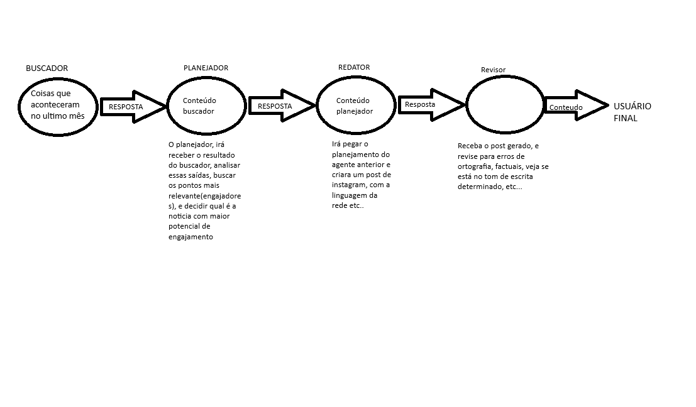
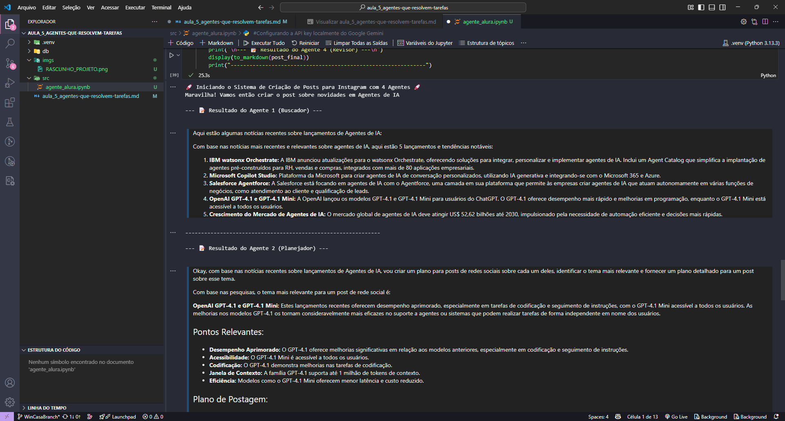
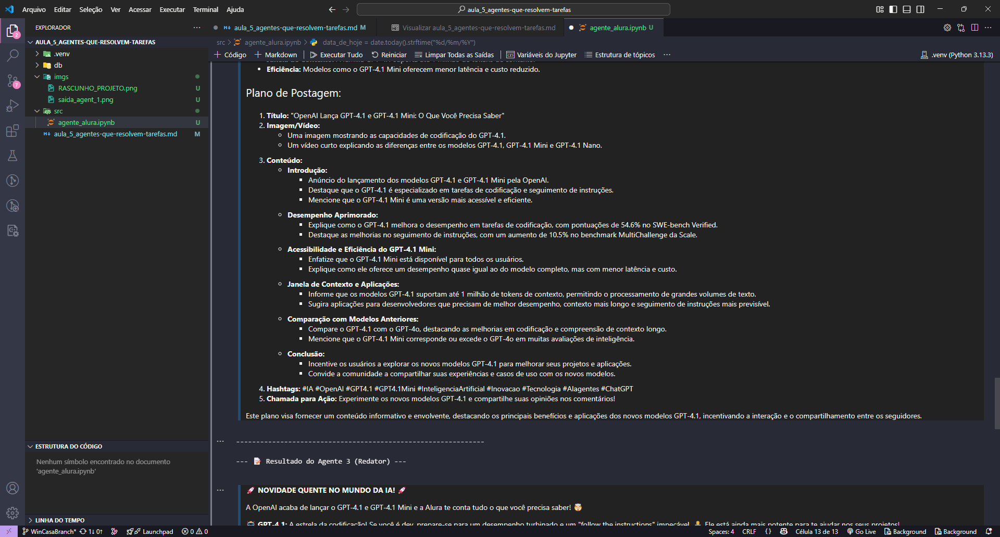
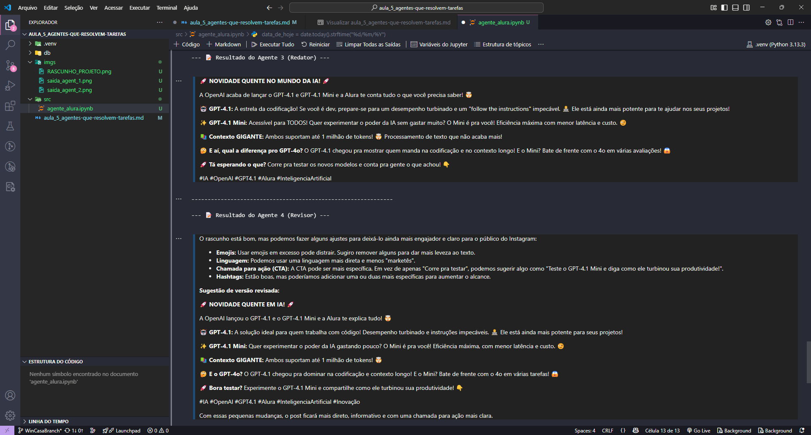

# Construindo agentes que resolvem tarefas por você

## Bem-vindos à quinta e última aula!  Chegou a hora de mergulhar na quarta aula da **Imersão IA da Alura e do Google Gemini** para dar um novo passo na sua carreira!  

- [Acesse o Google AI Studio](https://aistudio.google.com/app/prompts/new_chat?utm_source=website&utm_medium=referral&utm_campaign=Alura-may-25)
- [Pegar a API Key no Google AI Studio](https://aistudio.google.com/app/apikey?utm_source=website&utm_medium=referral&utm_campaign=Alura-may-25)
- [Acesse o Google Colab](https://colab.research.google.com/)
- [Acesse o Gemini](https://gemini.google.com/app?android-min-version=301356232&ios-min-version=322.0&is_sa=1&campaign_id=alura_may25&utm_source=alura&utm_medium=referral&utm_campaign=alura_may25&pt=9008&mt=8&ct=ref-alura-brmay25)

#### Links do projeto 
- [Código base inicial da aula 5 para programar junto com os instrutores](https://colab.research.google.com/drive/1JvMd5qKbIRaaypwC5gozr4UPURh3qqsQ)
- [Código final da aula 5](https://colab.research.google.com/drive/17woE3RUf5lZMEaPeRl-USp3jqaJWQqLC)
---
## Introdução 
Nesta última aual, você vai entender o que são agentes de IA e como funciona o ADK. Vai montar um agente com tools e lógica de decisão, além de implementar um sistema multiagentes básico focado em automação de tarefas de escrita. 
- Entender o que são agentes de IA e como o ADK funciona. 
- Montar um agente com tools, prompts e lógica de decisão. 
- Aprender o conceito de orquestração com múltiplos agentes. 
- Implementar um sistema mul-agentes básico, com foco em automação de tarefas de escrita. 
- [Links do projeto](#links-do-projeto)
---
## Links importantes para você acompanhar a aula. 
- [Google AI Studio](https://aistudio.google.com/app/prompts/new_chat?utm_source=website&utm_medium=referral&utm_campaign=Alura-may-25)
- [Pegar a API Key no Google AI Studio](https://aistudio.google.com/app/apikey?utm_source=website&utm_medium=referral&utm_campaign=Alura-may-25)
- [Google Colab](https://colab.research.google.com/)
- [Google Gemini](https://gemini.google.com/app?android-min-version=301356232&ios-min-version=322.0&is_sa=1&campaign_id=alura_may25&utm_source=alura&utm_medium=referral&utm_campaign=alura_may25&pt=9008&mt=8&ct=ref-alura-brmay25)
- [Guia de início rápido na API Gemini](https://ai.google.dev/gemini-api/docs?utm_source=website&utm_medium=referral&utm_campaign=Alura-may-25&hl=pt-br)
- [Exemplos do Google AI Studio](https://ai.google.dev/gemini-api/prompts?utm_source=website&utm_medium=referral&utm_campaign=Alura-may-25&hl=pt-br)
- [Cookbook de códigos do Gemini](https://github.com/google-gemini/cookbook)

--- 
## Mergulhe mais profundo 
- Mergulhe a fundo em carreiras tech com o [Techguide](https://techguide.sh/)
- [O que é Deep Learning?](https://www.alura.com.br/artigos/deep-learning-deep-fake)
- [O que é Python Pandas?](https://www.alura.com.br/artigos/pandas-o-que-e-para-que-serve-como-instalar)
---

# Notações Sobre a Video Aula 

## Sumário
- [O que são agentes de IA](#1-entender-o-que-são-agentes-de-ia-e-como-o-adk-funciona)
- [Configurando o agent](#11-como-o-adk-funciona)
- [Como funcionara o projeto](#3-sobre-o-projeto)
---
### 1. Entender o que são agentes de IA e como o ADK Funciona 
O que é um framework é uma biblioteca já pronta, onde o usuário final somente irá executar, no caso é o `ADK (Agent Development kit)` que pode ser traduzido como kit de desenvolvimento de agentes.   

podemos realizar outra configuração para nosso agente de IA, e que ao se definir a `System Instruction` ou modelo mesmo a ser gerado existe um parâmetro para que para além de base de treinamento do modelo, que no caso é o parâmetro de `config={"tools"}` conforme o código exemplificado abaixo podemos visualizar as propriedades dessa criação de modelo demais informações poderam ser obtidas em [Documentação ADK Google](https://google.github.io/adk-docs/). No exemplo abaixo será visualizado um trecho de como realizar buscas na internet para incrementar a resposta do modelo. 
```
response = client.models.generate_content(
    model=MODEL_ID, 
    contents='Quando é a proxima imersão IA com Google Gemini da Alura?', 
    config={"tools":[{"google_search": {}}]}
)
```
Nesse código acima, assim como visto anteriormente, é definido uma variavél para o modelo, e posteriormente, realizado a pergunta ou seu input primário. No que diverge dos demais vistos anteriormente se da no parâmetro de `config`, onde essa configuração recebera as ferramentas sendo mais especifico a ferramenta de busca definda em `[{"google_search":{}}]`

O que é um agent, de uma forma mais abstrata todo os códigos vistos na [Aula 4](../aula_4_primeiro-chatbot-com-ia/aula_4_primeiro-chatbot-com-ia.md), foram interações unicas e manuais com as `LLM'S`, seja fazendo uma pergunta ou solicitando para montar algo ou gerar algum código. porém com agent é como se tivessemos uma esteira de ações, onde será feito a configuração apenas uma vez desse agent e poderá ser utilizado diferentes modelos para diferentes demandas. Ou seja um agent será uma automatização dessas etapas de interações para modelos. 
Em outros termos, a criação de um agente nada mais é que a implementação de uma lógica no código para que ele tenha coesão e siga uma sequencia. 

### 2. Configurando um agent 
Para configurar esse agente em outras máquinas algumas instações são necessárias sendo elas 
```
# 1. configurar ou criar um ambiente virutal (opcional):
python -m venv .nomedoambiente
# 1.1. Ativando o ambiente virtual
source .nomedoambiente/bin/activate

# 2. com o ambiente virutal criado caso o 1º passo tenha sido adotado vamos instalar os SDK's
## As 3 primeiras SDKs dizem respeito a algumas outras bibliotécas que serão utilizadas no código da aula

pip install ipython 
pip install warnings
pip install requests

## As outras 2 bibliotecas abaixo dizem respeito as bibliotécas do google para interações com agentes e gemini
pip install google-genai
pip install google-adk

```
Após a configuração do ambiente em si foi realizado os *"Imports"* desses frameworks listados e comentados abaixo:
```
from google.adk.agents import Agent # Realiza a abstração do agent 
from google.adk.runners import Runner # O orquestrador que ira "rodar tudo"
from google.adk.sessions import InMemorySessionService # A memoria interna do orquestrador 
from google.adk.tools import google_search # a tooll no caso a busca do google 
from google.genai import types #Para criar conteúdos (Content e Part)
from datetime import date #Utilizado para bibliotéca de datas 
import textwrap #Para formatar melhor a saída de texto 
from IPython.display import display, Markdown #Para exibit texto formatado no colab 
import requests # Para fazer requisições HTTP
import warnings # Para controlar os aviso etc.. do código 

warnings.filterwarnings("ignore") # Utilizado para ignorar todos os avisos que forem emitidos 
```

### 3. Sobre o projeto 
O projeto que será construindo nessa [aula](src/agente_alura.ipynb), será multi-agente , que será dividio em 4 *"mini agentes"*, um agente realiza a busca de alguma Buscador de notícias na internet, um Planejador de posts, Retador do Post e por fim Revisador de Qualidade. Para melhor entendimento segue abaixo um modelo desenhado de como funcionara:
     <div id="diag_proj">
      
      </div>

Uma diferença entre api do anteriomente vista e do framework `ADK`, e que ao realizar a construção desse agente dessa maneira ao se calibrar o modelo, o parâmetro de `System Instruction`, agora é passado apenas como `instruction`, nesse modo ele irá reber de forma textual o que irá fazer etc.., outro ponto que diferentemente do que foi feito na api [ño codigo do tópico](#1-entender-o-que-são-agentes-de-ia-e-como-o-adk-funciona), onde foi declaro um parâmetro da seguinte forma, `config={"tools":[{"google_search": {}}]}` no adk essa configuração de ferramenta é feita apenas com uma lista dizendo quais serão as ferramentas utilizadas, por fim utilizaremos o parâmetro de instruction para definir o comportamento do agente. 
Outro ponto como estou utilizando no computador local tive algum problema com tokens por isso os modelos foram modificador para Gemini-2.0-flash

Com todas as configurações feitas e o [código](src/agente_alura.ipynb) estruturado obtivemos o seguinte resultado.   
     <div id="saida_agent">
      
      
      
      </div>

---
  <table style="text-align: center; width: 100%;"> 
  <caption><b>Skls do projeto </b></caption>
  <tr>
      <td style="text-align: center;">
      
      </td>
      <td style="text-align: center;">
      
      </td>
      <td style="text-align: center;">
      
      </td>
  </tr>
  <tr>
      <td style="text-align: center;">
      
      </td>
      <td style="text-align: center;">
      
      </td>
      <td style="text-align: center;">
      
      </td>
  </tr>
  </table>   

  ---
Titulo: Aula 5 Construindo agentes que resolvem tarefas por você  
Autor: Thierry Lucas Chaves  
Data criacao: 2025-05-16  
Data modificacao: 2025-05-16  
Versao: 1.0    
---